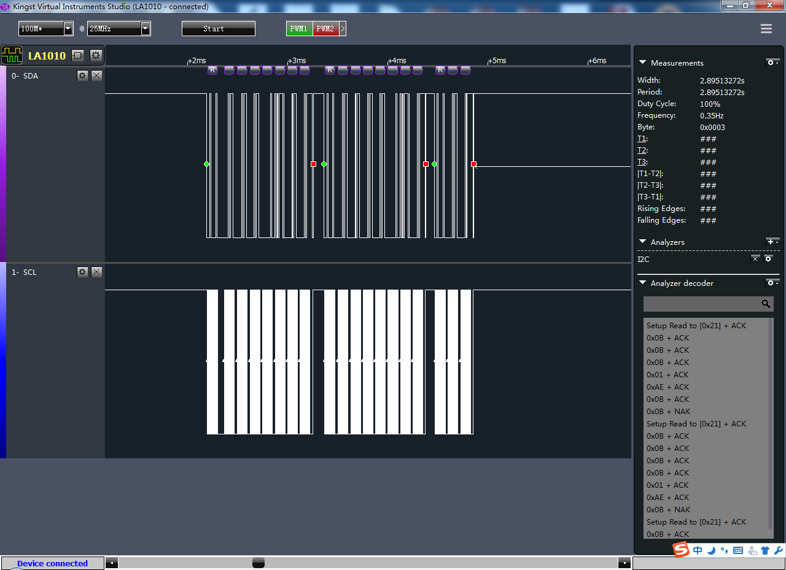

# NoiseModle

在Linux下通过I2C Bus获取噪声模块数据的的程序，并将数据输出到Console上。

## 噪声传感器

使用的是一个I2C接口的噪声传感器，在Linux系统上直接操作I2C Bus来获取传感器数据。

## 程序输出数据格式

```
    # ./noise 
    0b 0b 0b 01 ae 0b 0b 0b 0b 0b 0b 01 ae 0b 00 00
```

## I2C Bus通信数据



